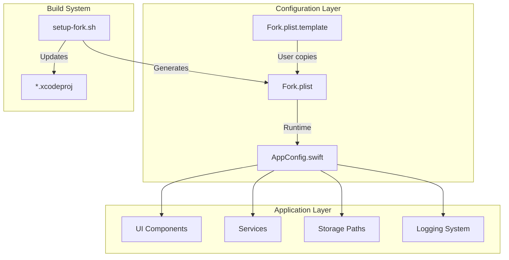

# VoiceInk Fork Configuration Architecture

> **Technical documentation of the configurable fork system**

## Overview

The fork configuration system transforms VoiceInk from a hardcoded application into a flexible, white-label platform. This document describes the technical architecture, implementation details, and design decisions.

## System Architecture



## Core Components

### 1. Fork.plist Configuration File

**Purpose:** External configuration file containing all customizable values

**Format:** Apple Property List (XML)

**Location:** Project root (gitignored)

**Structure:**

```xml
<?xml version="1.0" encoding="UTF-8"?>
<!DOCTYPE plist PUBLIC "-//Apple//DTD PLIST 1.0//EN" "...">
<plist version="1.0">
<dict>
    <!-- Required -->
    <key>BundleIdentifierPrefix</key>
    <string>com.example</string>

    <!-- Optional -->
    <key>WebsiteURL</key>
    <string>https://example.com</string>

    <!-- Feature Flags -->
    <key>ShowPurchaseOptions</key>
    <false/>
</dict>
</plist>
```

### 2. AppConfig.swift Singleton

**Purpose:** Central configuration manager that reads Fork.plist and provides type-safe access

**Implementation:**

```swift
final class AppConfig {
    static let shared = AppConfig()

    // Lazy initialization ensures Fork.plist is read once
    private init() {
        let configURL = Bundle.main.url(forResource: "Fork", withExtension: "plist")
        let config = configURL.flatMap { try? NSDictionary(contentsOf: $0, error: ()) }

        // Load with defaults
        bundleIdentifierPrefix = config?["BundleIdentifierPrefix"] as? String ?? "com.voiceink"
    }
}
```

**Design Decisions:**

1. **Singleton Pattern**: Single source of truth for configuration
2. **Lazy Loading**: Config read once at first access
3. **Fallback Defaults**: App remains functional without Fork.plist
4. **Type Safety**: Computed properties provide proper types

### 3. UI Adaptation Layer

**Pattern:** Conditional rendering based on configuration

**Example Implementation:**

```swift
struct LicenseManagementView: View {
    private let config = AppConfig.shared

    var body: some View {
        VStack {
            // Feature only shows if URL configured
            if let purchaseURL = config.purchaseURL,
               let url = config.url(from: purchaseURL) {
                Button("Purchase") {
                    NSWorkspace.shared.open(url)
                }
            }
            // Auto-hides if not configured
        }
    }
}
```

**Benefits:**

- Zero code changes needed for customization
- Features gracefully degrade
- Clean UI without broken links

## Implementation Details

### Bundle Identifier Management

**Challenge:** Bundle IDs are used throughout the codebase for:

- Application identity
- Storage paths
- Keychain access
- Logger subsystems
- Test targets

**Solution:** Dynamic bundle identifier generation

```swift
extension AppConfig {
    var mainBundleIdentifier: String {
        "\(bundleIdentifierPrefix).VoiceInk"
    }

    var applicationSupportPath: URL {
        FileManager.default.urls(for: .applicationSupportDirectory, in: .userDomainMask)[0]
            .appendingPathComponent(mainBundleIdentifier, isDirectory: true)
    }
}
```

**Files Updated:**

| File                 | Purpose            | Changes                                        |
| -------------------- | ------------------ | ---------------------------------------------- |
| `VoiceInk.swift`     | App initialization | Uses `AppConfig.shared.applicationSupportPath` |
| `WhisperState.swift` | Model storage      | Dynamic paths based on bundle ID               |
| `Recorder.swift`     | Logging            | Uses configured logger subsystem               |
| `*.xcodeproj`        | Build settings     | Updated by setup script                        |

### Logger Subsystem Configuration

**Original:** Hardcoded logger identifiers

```swift
Logger(subsystem: "com.prakashjoshipax.voiceink", category: "Feature")
```

**New:** Configured dynamically

```swift
Logger(subsystem: AppConfig.shared.loggerSubsystem, category: "Feature")
```

**Affected Files:**

- `Recorder.swift`
- `WhisperState.swift`
- `LibWhisper.swift`
- `AudioDeviceConfiguration.swift`
- `LocalTranscriptionService.swift`
- `NativeAppleTranscriptionService.swift`
- `ParakeetTranscriptionService.swift`
- `ActiveWindowService.swift`
- `BrowserURLService.swift`
- `PromptDetectionService.swift`

### Storage Path Management

**Challenge:** Application Support paths include bundle identifier

**Original:**

```swift
let appSupportURL = FileManager.default.urls(for: .applicationSupportDirectory, in: .userDomainMask)[0]
    .appendingPathComponent("com.jshimko.VoiceInk")
```

**New:**

```swift
let appSupportURL = AppConfig.shared.applicationSupportPath
```

**Directory Structure:**

```
~/Library/Application Support/
└── {BundleIdentifier}/
    ├── WhisperModels/
    ├── Recordings/
    ├── ParakeetModels/
    └── default.store (SwiftData)
```

### Feature Flag System

**Implementation:** Boolean flags control feature visibility

```swift
// In AppConfig.swift
let showPurchaseOptions: Bool
let showCommunityLinks: Bool
let showDonationLink: Bool

// In UI Components
if config.showPurchaseOptions {
    // Show purchase UI
}
```

**Advantages:**

- No dead code in production
- Features can be A/B tested
- Easy to maintain different editions

## Setup Script Architecture

### scripts/setup-fork.sh

**Purpose:** Interactive configuration generator

**Flow:**

```bash
1. Validate environment
   └── Check for VoiceInk.xcodeproj

2. Collect user input
   ├── Required: bundle ID, email
   └── Optional: URLs, features

3. Generate Fork.plist
   └── XML with user values

4. Update project files
   ├── Bundle identifiers in .xcodeproj
   └── Test target identifiers

5. Provide instructions
   └── Next steps for Xcode
```

**Key Features:**

- Interactive prompts with defaults
- Validation of inputs
- Automatic project updates
- Safe for repeated runs

## Configuration Loading Process

### Startup Sequence

```swift
1. App Launch
   ↓
2. AppConfig.shared accessed (first time)
   ↓
3. Singleton init()
   ├── Look for Fork.plist in bundle
   ├── Parse if found
   └── Use defaults if missing
   ↓
4. Configuration cached in memory
   ↓
5. UI components read from AppConfig
```

### Error Handling

**Missing Fork.plist:**

- App uses safe defaults
- All features disabled
- Core functionality preserved

**Invalid Fork.plist:**

- Logged to console
- Falls back to defaults
- User warned in debug builds

## Design Patterns

### 1. Graceful Degradation

Features automatically hide when not configured:

```swift
if let url = config.websiteURL {
    // Show website button
}
// No else needed - feature absent
```

### 2. Configuration Injection

Views receive configuration via environment:

```swift
struct ContentView: View {
    private let config = AppConfig.shared
    // Use throughout view
}
```

### 3. Computed Properties

Dynamic values calculated from base config:

```swift
var mainBundleIdentifier: String {
    "\(bundleIdentifierPrefix).VoiceInk"
}
```

### 4. Optional Chaining

Safe navigation through optional configs:

```swift
if let docsURL = config.docsURL,
   let url = config.url(from: docsURL) {
    // Show documentation link
}
```

## File Structure

```
VoiceInk/
├── Fork.plist                 # User configuration (gitignored)
├── Fork.plist.template        # Template for users
├── VoiceInk/
│   ├── AppConfig.swift        # Configuration manager
│   ├── VoiceInk.swift        # Uses config for paths
│   └── Views/
│       └── *.swift           # Conditional UI rendering
└── scripts/
    └── setup-fork.sh         # Configuration generator
```

## Migration Strategy

### From Hardcoded to Configured

**Phase 1: Identify**

```bash
grep -r "com\..*voiceink" --include="*.swift"
grep -r "https://" --include="*.swift"
```

**Phase 2: Abstract**

```swift
// Before
let url = "https://tryvoiceink.com/docs"

// After
let url = AppConfig.shared.docsURL
```

**Phase 3: Update**
All references updated to use AppConfig

**Phase 4: Test**
Verify with different configurations

## Testing Configuration

### Unit Tests

```swift
class AppConfigTests: XCTestCase {
    func testDefaultConfiguration() {
        // Test without Fork.plist
        let config = AppConfig()
        XCTAssertEqual(config.bundleIdentifierPrefix, "com.voiceink")
    }

    func testCustomConfiguration() {
        // Test with custom Fork.plist
        // ...
    }
}
```

### Integration Tests

1. **Empty Config**: App launches without Fork.plist
2. **Minimal Config**: Only required fields
3. **Full Config**: All features enabled
4. **Invalid Config**: Malformed Fork.plist

## Performance Considerations

### Configuration Caching

- Fork.plist read once at startup
- Values cached in memory
- No runtime file I/O
- Negligible memory overhead (~1KB)

### Compile-Time Optimization

Swift compiler optimizes away:

- Unreachable code paths
- Unused optional chains
- Empty if blocks

## Security Considerations

### Fork.plist Security

**Risks:**

- Contains organization identity
- May contain sensitive URLs
- Could expose internal infrastructure

**Mitigations:**

- Gitignored by default
- Template contains only examples
- No secrets in configuration
- API keys remain in Keychain

### URL Validation

All URLs validated before use:

```swift
func url(from urlString: String?) -> URL? {
    guard let urlString = urlString,
          !urlString.isEmpty,
          let url = URL(string: urlString) else {
        return nil
    }
    return url
}
```

## Future Enhancements

### Planned Improvements

1. **Multiple Configurations**

   - Development.plist
   - Staging.plist
   - Production.plist

2. **Build-Time Selection**

   ```bash
   xcodebuild -xcconfig Config/Production.xcconfig
   ```

3. **Feature Flags Service**

   - Remote configuration
   - A/B testing
   - Gradual rollouts

4. **Configuration Validation**

   - JSON Schema validation
   - Required field checking
   - URL format validation

5. **Configuration UI**
   - In-app configuration editor
   - Import/export configs
   - Configuration profiles

## Troubleshooting

### Common Issues

**Issue:** Changes to Fork.plist don't take effect
**Solution:** Clean build (Cmd+Shift+K) and rebuild

**Issue:** Bundle ID conflicts
**Solution:** Ensure unique BundleIdentifierPrefix

**Issue:** Features not hiding
**Solution:** Check for empty strings vs. nil in config

## Best Practices

### For Maintainers

1. **Keep AppConfig centralized** - Single source of truth
2. **Document new configs** - Update Fork.plist.template
3. **Provide defaults** - App must work without config
4. **Test configurations** - Multiple scenarios
5. **Version configs** - Track changes

### For Contributors

1. **Use AppConfig** - Never hardcode values
2. **Make features optional** - Graceful degradation
3. **Update template** - Include new options
4. **Document changes** - Update this guide
5. **Test without config** - Ensure defaults work

## Conclusion

The fork configuration architecture successfully transforms VoiceInk into a flexible, white-label platform while maintaining:

- **Simplicity**: Single config file
- **Safety**: Works without configuration
- **Flexibility**: All aspects configurable
- **Privacy**: No forced external communication
- **Maintainability**: Clear separation of concerns

This architecture enables anyone to create their own branded version of VoiceInk without touching Swift code.

---

_Architecture version: 1.0_
_Last updated: October 2025_
